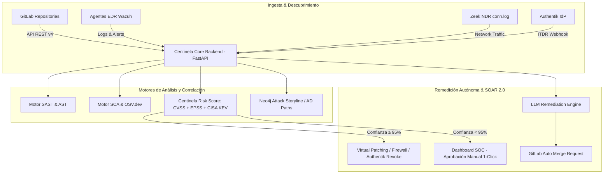

# 🛡️ Presentación Ejecutiva y Técnica: Plataforma Centinela-AI
> **Ecosistema Omni-XDR & AI Governance para la Organización**  
> *Documento de Propuesta Técnica, Estratégica y de Comercialización para Aprobación Directiva*

---

## 📌 Índice de la Presentación

1. **Resumen Ejecutivo**
2. **Origen y Justificación**: *¿Por qué se desarrolló Centinela-AI?*
3. **Propósito y Finalidad**: *¿Para qué sirve?*
4. **Visión General y Funcionalidades Clave**: *¿Qué hace el sistema?*
5. **Arquitectura y Funcionamiento Técnico**: *¿Cómo funciona?*
6. **Beneficios Organizacionales**: *¿Qué aporta a la empresa?*
7. **Estrategia de Comercialización Futura**: *Modelo de Negocio y Monetización (SaaS / Enterprise)*
8. **Hoja de Ruta (Roadmap) y Siguientes Pasos**

---

## 1. 🚀 Resumen Ejecutivo

**Centinela-AI es el vigilante permanente de la seguridad de Casmarts.** Revisa de forma continua servidores, bases de datos, aplicaciones y todo el código fuente de la organización en busca de puntos débiles, usa Inteligencia Artificial para entender qué tan grave es cada uno, y ayuda a corregirlos — con la aprobación de una persona antes de aplicar cualquier cambio.

Antes de Centinela-AI, esa vigilancia dependía de más de una decena de herramientas desconectadas entre sí, sin nadie con tiempo de revisarlas todas juntas. Hoy es un solo sistema, con un solo panel, que convierte alertas técnicas en explicaciones claras y en correcciones listas para aprobar.

> **Nota de transparencia (28 de agosto de 2026):** las cifras de este documento reflejan el estado real y verificado del sistema en producción, no estimaciones. Ver la sección 1.1 para el detalle — incluyendo lo que todavía está pendiente.

---

## 1.1 📊 Estado Real Verificado (28 de agosto de 2026)

Cifras confirmadas en vivo contra el sistema en producción, no estimaciones:

| Indicador | Valor real | Nota |
| :--- | :--- | :--- |
| Activos monitoreados | **95** | 79 repositorios de código (GitLab), 9 servidores, 4 bases de datos, 1 servidor de aplicaciones, 1 estación de trabajo |
| Hallazgos de **seguridad reales** (categoría VULNERABILITY) | **7,545** | separados desde el 14–20 de agosto de **26,175** hallazgos **informativos** (calidad de código, deuda técnica de proceso, marcadores de auditoría). El número combinado sobrerrepresenta el riesgo real: el 92 % de los hallazgos pertenece a repositorios de código, no a infraestructura |
| Hallazgos de seguridad reales **abiertos** | **6,661** | el resto ya está resuelto o suprimido como falso positivo / riesgo aceptado |
| Hallazgos críticos reales abiertos | **280** | requieren atención prioritaria |
| Vulnerabilidades con explotación activa confirmada (abiertas) | **24** | según el catálogo oficial CISA KEV (EE.UU.) |
| Incumplimientos de plazo de corrección (SLA) — reales abiertos | **869** | de ellos **271 críticos** |
| Acciones autónomas registradas en bitácora | **1,399** | correlación IA, apertura de Merge Requests de auto-fix, limpieza de contenedores, enriquecimiento de *threat intel* — todo auditable |
| Proveedores de IA en cadena de respaldo | **4** | Groq, Gemini, NVIDIA, OpenRouter — si uno falla o agota su cuota, el siguiente responde automáticamente |
| Cobertura de pruebas automatizadas | **122/122 pasan** | sube de 62/62 (13 ago); pruebas nuevas para el motor WCAG, el realineamiento CMMI y los 5 subsistemas de detección avanzada |

### 1.2 🔧 Evolución desde el 13 de agosto de 2026

**Clasificación real vs. informativo (14–20 ago).** Se añadió una clasificación automática que separa los hallazgos de seguridad reales (algo que un atacante podría aprovechar) de los informativos (calidad de código, métricas de proceso, marcadores). El tablero mostraba antes un solo total sin diferenciar que exageraba el riesgo; ahora ambos se ven por separado y las notificaciones y filtros del centro de operaciones respetan esa distinción.

**Nuevo motor de accesibilidad WCAG 2.1 (25 ago).** El manual de metodología propio de C&A exige accesibilidad como requisito legal en los proyectos de gobierno del Estado de México. Centinela no tenía cobertura dedicada; ahora audita 6 reglas estáticas (texto alternativo faltante, controles de formulario sin etiqueta, enlaces/botones sin nombre accesible, `lang` faltante, `tabindex` positivo, elementos clicables sin rol) e integra los hallazgos al ciclo periódico. 224 hallazgos reales verificados en vivo contra SIAT/SIDECO tras corregir dos clases de falso positivo.

**Realineamiento del motor CMMI contra la metodología real de C&A (25 ago).** Se cruzó el motor contra el manual `Manual_Metodologia_CA_v2_COMPLETO.docx` y se encontraron dos códigos de área fabricados (`SAM`, `MSR`) que no existen en el modelo de 19 áreas tailored de la empresa. Reemplazados por 5 áreas que un escáner de código puede evidenciar honestamente: causa raíz (`CAR`), higiene de código (`PQA`), gestión de configuración vía historial Git real (`CM`), monitoreo y control (`MC`) y verificación (`VV`). Las otras 14 áreas quedan explícitamente marcadas "no evaluado" en vez de asumidas.

**Cinco subsistemas de detección avanzada (27 ago).** Incorporados tras evaluar dos referencias del mercado (CodeRabbit para revisión de código asistida por IA, y el SOC agéntico "The Rock" de KIO):

| Subsistema | Qué aporta |
| :--- | :--- |
| **Memoria de falsos positivos** | Un analista puede silenciar un hallazgo o una familia de hallazgos ya revisados; dejan de generar ruido pero se sigue contando cuántas veces reaparecen |
| **Bitácora de acciones autónomas** | Registro único y auditable de toda acción que el sistema toma por su cuenta (1,399 a la fecha) |
| **Contexto de radio de impacto** | Antes de pedir un parche a la IA, Centinela lee la función completa afectada y busca dónde más se usa ese código, para un diagnóstico más preciso |
| **Revisión de Merge Request "shift-left"** | Al abrir un cambio en GitLab, se escanean solo las líneas nuevas y se marca el cambio como bloqueante si introduce algo de severidad alta *(la ruta de lectura está verificada; la escritura de comentarios en GitLab queda pendiente por decisión de dirección)* |
| **Motor de correlación de incidentes** | Agrupa automáticamente varias alertas relacionadas (mismo activo, misma ventana de tiempo, mismo indicador) en un solo caso investigable, con cadena de ataque MITRE ATT&CK y relojes de tiempo de detección/contención |

**Limpieza del registro de amenazas en tiempo real (28 ago).** El "Log Maestro" estaba 99.9 % lleno de ruido de los propios contenedores de escaneo de Centinela y del latido del sensor de red. Se filtró ese ruido en el origen, se depuraron ~16,175 filas acumuladas y se normalizó la severidad a una escala única. También se corrigió que el tablero se quedaba "Cargando…" varios segundos porque un verificador de conectividad bloqueaba el servidor; ahora responde en milisegundos.

**Re-escaneo de SIAT y SIDECO con código fresco (28 ago).** Se recibieron los repositorios actualizados de SIAT y SIDECO y se re-auditaron con los detectores actuales (severidad CVSS real en dependencias, motor WCAG, CMMI realineado), reconciliando automáticamente como "resuelto" todo hallazgo que el código nuevo ya no reproduce.

**Por qué esto importa:** un sistema de seguridad que reporta cifras poco confiables es tan riesgoso como no tener sistema — puede dar una falsa sensación de control. Separar lo real de lo informativo, mantener las cifras verificadas y dejar bitácora de cada acción autónoma es lo que sostiene la confianza con clientes y auditores.

---

## 📖 Glosario de Conceptos Clave (Para Ejecutivos y Desarrolladores)

Para garantizar una comprensión clara entre la alta dirección y los equipos técnicos, a continuación se definen los términos fundamentales que sustentan a Centinela-AI:

### 💼 A. Términos de Negocio, Gobierno y Estándares
* **CMMI v3.0 (Capability Maturity Model Integration):** Modelo internacional de madurez de procesos de software. *Para el ejecutivo:* Mide qué tan estructurado, repetible y maduro es el proceso de desarrollo de la empresa. *Para el desarrollador:* el motor propio de Centinela evalúa 5 áreas reales que un escáner de código puede evidenciar honestamente — análisis de causa raíz (`CAR`), higiene de código (`PQA`), gestión de configuración vía historial Git real (`CM`), monitoreo y control (`MC`) y verificación (`VV`) — de las 19 áreas del modelo tailored real de C&A (realineado 25 ago 2026 cruzando el motor contra el manual de metodología propio de la empresa; los códigos `SAM`/`MSR` usados antes no correspondían a ninguna área real de ese modelo).
* **ISO/IEC 27001:2022:** Norma internacional de Sistemas de Gestión de Seguridad de la Información (SGSI). Exige controles estrictos de vulnerabilidades (`A.8.8`) y monitoreo de eventos (`A.8.16`).
* **ISO/IEC 25010 / 25001 (SQuaRE):** Estándar internacional que mide la **Calidad del Software**. *Para el ejecutivo:* Garantiza que el software sea mantenible y eficiente. *Para el desarrollador:* Audita complejidad cognitiva, ausencia de retardos duros (`sleep`) y cero deuda técnica.
* **Shift Left (Desplazar a la Izquierda):** Filosofía DevSecOps que consiste en detectar fallos de seguridad durante la escritura del código en lugar de esperar a que la aplicación esté publicada en producción.

---

### 🛡️ B. Módulos y Tecnologías de Ciberseguridad
* **SAST (Static Application Security Testing):** *Pruebas Estáticas de Seguridad.* Analiza el código fuente línea por línea sin ejecutar la aplicación para hallar errores de programación (ej. Inyección SQL, llaves secretas expuestas).
* **SCA (Software Composition Analysis):** *Análisis de Composición de Software.* Audita los paquetes de terceros y librerías Open Source (`npm`, `pip`, `maven`) en busca de vulnerabilidades conocidas.
* **DAST (Dynamic Application Security Testing):** *Pruebas Dinámicas de Seguridad.* Evalúa la aplicación en ejecución simulando ataques externos desde la red (HTTP/REST).
* **EDR (Endpoint Detection and Response):** Agente instalado en computadoras y servidores (Linux/Windows/macOS) que monitorea llamadas al sistema, procesos y archivos sospechosos en tiempo real.
* **NDR (Network Detection and Response):** Monitoreo continuo del tráfico de red (vía Zeek) para detectar anomalías y transferencias sospechosas de datos.
* **ITDR (Identity Threat Detection and Response):** Protección de la capa de identidad (Authentik / Active Directory) ante ataques de fuerza bruta, robo de credenciales o suplantación.
* **XDR (Extended Detection and Response):** Plataforma de última generación (como Centinela-AI) que **unifica EDR + NDR + SAST + ITDR** en una sola consola para ver la película completa de un ataque.
* **SOAR (Security Orchestration, Automation and Response):** Motor que ejecuta respuestas automáticas ante incidentes (aislar un servidor, revocar un usuario o enviar un parche de código a GitLab). En Centinela, **ninguna acción se ejecuta sin aprobación humana previa**.
* **WCAG 2.1 (Web Content Accessibility Guidelines):** Pautas internacionales de accesibilidad web. *Para el ejecutivo:* en los proyectos de gobierno del Estado de México es un **requisito legal**, no una preferencia de diseño. *Para el desarrollador:* motor estático nativo con 6 reglas (alt faltante, controles sin etiqueta, enlaces/botones sin nombre accesible, `lang` faltante, `tabindex` positivo, elementos clicables sin rol).
* **Correlación de Incidentes:** Motor que agrupa automáticamente varias alertas relacionadas (mismo activo, misma ventana de tiempo, mismo indicador de compromiso) en un solo caso investigable, con cadena de ataque MITRE ATT&CK y relojes MTTD/MTTC (tiempo medio hasta detectar / hasta contener).
* **Bitácora de Acciones Autónomas:** Registro único y auditable de toda acción que el sistema toma por su cuenta (analizar un hallazgo, abrir un Merge Request de corrección, limpiar un contenedor huérfano), para poder revisarla después.
* **Memoria de Falsos Positivos:** Mecanismo por el que un analista silencia un hallazgo ya revisado (falso positivo o riesgo aceptado); deja de aparecer en la cola de trabajo pero se sigue contando cuántas veces vuelve a dispararse.
* **Revisión de Merge Request (Shift-Left):** Al abrir un cambio de código en GitLab, Centinela escanea únicamente las líneas nuevas y puede marcar el cambio como bloqueante si introduce una vulnerabilidad de severidad alta, antes de que se integre.

---

### 🎯 C. Métricas de Priorización de Vulnerabilidades
* **CVE (Common Vulnerabilities and Exposures):** Identificador universal único asignado a un fallo de seguridad conocido a nivel mundial (ej. `CVE-2024-29041`).
* **CVSS (Common Vulnerability Scoring System):** Escala técnica del 0 al 10 que mide la gravedad teórica de una vulnerabilidad.
* **EPSS (Exploit Prediction Scoring System):** Porcentaje (0% a 100%) que predice la **probabilidad real** de que un atacante intente explotar esa vulnerabilidad en los próximos 30 días.
* **CISA KEV (Known Exploited Vulnerabilities):** Catálogo oficial del gobierno de EE.UU. que confirma que una vulnerabilidad **ya está siendo atacada activamente en el mundo real**. Centinela le asigna prioridad crítica inmediata.

---

## 2. 💡 Origen y Justificación: ¿Por qué se desarrolló?

La evolución acelerada de las amenazas informáticas y la adopción de herramientas de IA y microservicios genera los siguientes problemas críticos en la industria:

* **Fragmentación de Herramientas (Tool Sprawl):** Las organizaciones emplean entre 10 y 15 herramientas desconectadas (SAST, SCA, DAST, EDR, CSPM), generando silos de información, alertas duplicadas y sobrecarga operativa (*alert fatigue*).
* **Falta de Gobernanza sobre Inteligencia Artificial (OWASP Top 10 para LLMs):** El uso creciente de modelos IA expone vectores de ataque nuevos (inyección de prompts, fuga de PII, ejecución de código no controlado).
* **Brecha entre Detección y Remediación:** Detectar una vulnerabilidad (CVE) suele tomar minutos, pero corregirla en producción lleva semanas o meses por falta de parches automatizados.
* **Costos Elevados de Licenciamiento:** Las soluciones XDR y SIEM del mercado corporativo imponen costos por gigabyte o activo que escalan de forma insostenible.

---

## 3. 🎯 Propósito y Finalidad: ¿Para qué sirve?

La finalidad principal de Centinela-AI es **proteger los activos digitales de la organización en tiempo real, garantizar el cumplimiento normativo e institucional y reducir el Tiempo Medio de Reparación (MTTR)** mediante automatización inteligente.

### Objetivos Clave:
1. **Detección Omnidireccional:** Visibilidad 360° sobre aplicaciones, repositorios, código, infraestructura local/nube y modelos LLM.
2. **Remediación Autónoma (SOAR 2.0):** Generación automática de parches y Merge Requests (MRs) en GitLab sin degradar el código de producción.
3. **Cumplimiento Automático:** Mapeo instantáneo de hallazgos hacia marcos normativos (**ISO 27001**, **NIST SP 800-53**, **PCI-DSS v4.0**, **SOC 2**, **GDPR**, **ISO 25010** y **STRIDE**).

---

## 4. 🔍 Visión General y Funcionalidades Clave: ¿Qué hace el sistema?

Centinela-AI se estructura sobre **6 Pilares de Auditoría e Integración**:

| Pilar / Módulo | Funcionalidades Principales | Herramientas & Motores Integrados |
| :--- | :--- | :--- |
| **1. Auditoría SAST, Clean Code & Accesibilidad** | Detección de SQLi, Command Injection, SSRF, BOLA, Secretos Hardcodeados, Complejidad Cognitiva (<15), ISO 25010 y accesibilidad WCAG 2.1 (requisito legal en proyectos de gobierno). | Motor AST nativo, Semgrep (multi-lenguaje), SonarQube, motor WCAG nativo |
| **2. Auditoría SCA & Dependencias** | Análisis de dependencias (npm, pip, Maven, Go, Composer), vulnerabilidades conocidas con severidad CVSS real, y análisis de alcanzabilidad (reachable / unreachable). | Motor SCA nativo ([OSV.dev](https://osv.dev)) |
| **3. Hardening e Infraestructura (IaC)** | Análisis de Dockerfiles (antipatrón `root`), manifiestos Kubernetes, Terraform y CIS Benchmarks Linux Level 1 (SSH). | Checkov, Auditor CIS SSH nativo |
| **4. Gobernanza de IA & LLMs** | Inyección de prompts (OWASP LLM01), fuga de datos/PII (LLM02), ejecución de código inseguro (LLM06). | `medusa-security`, OWASP LLM Engine |
| **5. Monitoreo Runtime & Correlación de Incidentes (EDR / NDR / ITDR)** | Detección de amenazas de identidad Authentik, telemetría de red, ingesta de syscalls kernel, agentes de host, y agrupación automática de alertas relacionadas en incidentes con cadena de ataque MITRE ATT&CK y relojes MTTD/MTTC. | Wazuh EDR, Zeek NDR, eBPF Tracing, motor de incidentes nativo |
| **6. Auto-Fix DevSecOps, SOAR 2.0 & Revisión de MR** | Parches determinísticos y vía LLM con Merge Requests en GitLab; revisión "shift-left" de cambios sobre las líneas nuevas de cada MR; memoria de falsos positivos / riesgo aceptado. | GitLab REST API, cadena de 4 proveedores de IA |

---

## 5. ⚙️ Arquitectura y Funcionamiento Técnico: ¿Cómo funciona?



### Flujo de Operación Técnica:
1. **Descubrimiento Continuo:** Se conectan repositorios GitLab y servidores.
2. **Análisis Multicapa:** Se ejecutan los motores SAST, SCA, DAST e IaC.
3. **Puntuación de Riesgo Dinámica (CRS):** Combina severidad CVSS con probabilidad de explotación real (**EPSS**) y presencia en catálogos de ataques activos (**CISA KEV**).
4. **Remediación Segura:**
   - **Parchado Mecánico (Sin LLM):** Corrección automática de versiones obsoletas o directivas de Docker.
   - **Parchado por IA (Diff Unificado):** Generación de parches precisos para código complejo sin alterar la lógica de negocio.
   - **Enrutamiento Git:** Todo cambio genera una rama `centinela-fix/*` y un Merge Request formal; **nunca se fuerza push directo**.

---

## 6. 🏆 Beneficios Organizacionales: ¿Qué aporta su uso?

### Para la Dirección / Ejecutivos:
* **Reducción de Riesgo de Brechas:** Blindaje preventivo de la superficie de ataque corporativa.
* **Ahorro de Costos Directos:** Eliminación de múltiples licencias individuales de ciberseguridad.
* **Cumplimiento Normativo Instantáneo:** Generación de reportes de auditoría PDF para **ISO 27001**, **NIST**, **PCI-DSS** y **SOC 2** con un clic.

### Para el Líder de Equipo y Arquitectos:
* **Visibilidad Centralizada:** Un solo tablero para controlar vulnerabilidades, calidad de software e infraestructura.
* **Priorización Basada en Riesgo Real:** Focalización en vulnerabilidades explotables en el mundo real (EPSS/CISA KEV) en lugar de listas masivas irrelevantes.
* **Control de Calidad (Quality Gates):** Integración nativa con pipelines CI/CD para impedir la salida a producción de código vulnerable.

### Para el Equipo de Desarrollo:
* **Fricción Cero:** Remediación automatizada mediante Merge Requests listos para revisar y fusionar.
* **Educación y Buenas Prácticas:** Explicación detallada en cada MR sobre el motivo de la vulnerabilidad y cómo prevenirla.
* **Feedback Temprano (Shift Left):** Detección de fallos de seguridad durante la etapa de código, no en producción.

---

## 7. 💼 Estrategia de Comercialización Futura

Centinela-AI posee un alto potencial para posicionarse como un producto **B2B SaaS / Enterprise On-Premise** en el mercado de ciberseguridad.

### Modelos de Monetización Propuestos:

```
                  ┌──────────────────────────────────────────┐
                  │          Modelos de Negocio              │
                  └────────────────────┬─────────────────────┘
                                       │
         ┌─────────────────────────────┼─────────────────────────────┐
         ▼                             ▼                             ▼
┌──────────────────┐         ┌──────────────────┐         ┌──────────────────┐
│ SaaS Enterprise  │         │ On-Premise Self- │         │  MSSP / Managed  │
│    (Cloud)       │         │    Hosted        │         │     Services     │
├──────────────────┤         ├──────────────────┤         ├──────────────────┤
│ Pago por Activo  │         │ Licencia Anual   │         │ Licencia para    │
│ o Repositorio    │         │ por Nodo / Core  │         │ Consultoras de   │
│ Monitoreado      │         │ + Soporte VIP    │         │ Ciberseguridad   │
└──────────────────┘         └──────────────────┘         └──────────────────┘
```

1. **SaaS Enterprise (Nube Administrada):**
   - Suscripción mensual/anual basada en la cantidad de activos monitoreados (repositorios, servidores, contenedores).
   - Planes *Tiered*: Standard, Professional y Enterprise.
2. **Enterprise On-Premise / Air-Gapped (Para Banca, Gobierno y Salud):**
   - Licenciamiento por nodos/infraestructura para clientes con requerimientos estrictos de privacidad que no pueden enviar datos a la nube.
3. **Plataforma para Consultoras de Seguridad (MSSP Partner Program):**
   - Licencias multitenant para empresas de auditoría que ofrecen servicios gestionados de SOC y DevSecOps a sus clientes.

---

## 8. 🗺️ Hoja de Ruta (Roadmap) y Siguientes Pasos

Para consolidar la aprobación directiva y avanzar a la fase de desarrollo a profundidad:

- [x] **Fase 1: Core Engine & Multi-Auditor (Completado)**  
  Integración de motores SAST/SCA nativos, EDR/NDR, reglas ISO/NIST y motor de parches GitLab.
- [x] **Fase 2: Estrategia Híbrida & Multi-OS EDR (Completado)**  
  Instaladores desatendidos para Linux, Windows y macOS; soporte IPv6, monitoreo Agentless y matriz CMMI / ISO 27001.
- [x] **Fase 2.5: Precisión, Accesibilidad y Detección Avanzada (Completado, ago 2026)**  
  Clasificación real vs. informativo; motor de accesibilidad WCAG 2.1; realineamiento del motor CMMI contra la metodología propia de C&A; cobertura Semgrep multi-lenguaje; y cinco subsistemas nuevos: memoria de falsos positivos, bitácora de acciones autónomas, contexto de radio de impacto, revisión de Merge Request "shift-left" y motor de correlación de incidentes.
- [ ] **Fase 3: Expansión Cloud-Native & CSPM**  
  El motor CSPM nativo ya audita configuraciones de nube (buckets, IAM, security groups) bajo demanda; falta ampliarlo a conectores continuos AWS/GCP/Azure con Prowler y a un Admission Controller de Kubernetes en caliente.
- [ ] **Fase 4: Certificación de Cumplimiento Oficial**  
  Certificación del producto bajo esquemas SOC 2 Type II e ISO 27001 para comercialización internacional.

---

## 9. 💡 Justificación Estratégica: Software Open Source vs. Soluciones Comerciales

### ¿Por qué Centinela adopta una Estrategia Open Source + EDR en esta Fase?
1. **Eficiencia Presupuestaria y Retorno de Inversión (ROI):**
   - Las licencias comerciales tradicionales (Qualys, Tenable, CrowdStrike) cobran por activo o por volumen de datos, con costos que escalan rápidamente a más de 100 activos — cifra exacta pendiente de cotización formal, no incluida aquí para evitar reportar un número no verificado.
   - La arquitectura Open Source de Centinela (Wazuh, Zeek, Trivy, Nuclei, Vault) elimina el costo recurrente de licencias, dirigiendo el presupuesto hacia ingeniería y personalización interna.
2. **Soberanía de Datos y Cumplimiento Zero-Trust:**
   - La telemetría, código fuente y secretos nunca abandonan la infraestructura de CASMARTS ni se envían a nubes de terceros no auditables.
3. **Flexibilidad e Integración Híbrida:**
   - Centinela incluye conectores para integrar soluciones comerciales existentes (VirusTotal Enterprise, MISP, Qualys, Tenable.io) mediante conectores API centralizados almacenados en HashiCorp Vault.

---

## 10. 🛡️ Estándares Internacionales EDR/XDR, Matriz de Cumplimiento y Mapeo de Puertos

### A. Cobertura Multi-Sistema Operativo y Descarga de Agentes
- **Linux (Ubuntu, Debian, RHEL, CentOS):** Script Bash desatendido (`.sh`) con configuración automática de repositorio.
- **Windows (Server 2019/2022, Windows 10/11):** Script PowerShell desatendido (`.ps1`) ejecutado en modo Administrador.
- **macOS (Apple Silicon M1-M3 & Intel):** Script Zsh (`.sh`) para despliegues en estaciones de trabajo institucionales.
- **Agentless / En Línea:** Monitoreo ICMP/TCP sin credenciales para dispositivos donde no es posible instalar software (Cisco, VMware, Cloud).

### B. Mapeo de Puertos de Red
| Puerto / Protocolo | Origen → Destino | Propósito |
| :--- | :--- | :--- |
| `1514 / TCP-UDP` | Agente → Manager (`10.4.3.34`) | Telemetría de eventos cifrada Wazuh EDR |
| `1515 / TCP` | Agente → Manager (`10.4.3.34`) | Inscripción automática de agentes nuevos |
| `55000 / TCP` | Backend → Manager (`10.4.3.34`) | API REST de orquestación y control |
| `5432 / 3306 / 1433` | Probes → RDBMS | Auditoría de bases de datos PostgreSQL / MySQL / SQL Server |

### C. Matriz de Cumplimiento Normativo Auditada
| Estándar Internacional | Control / Área de Proceso | Mecanismo en Centinela AI |
| :--- | :--- | :--- |
| **ISO/IEC 27001:2022** | Control A.8.8 (Gestión de Vulnerabilidades) | Escaneo automatizado diario con 5 motores SAST/SCA/DAST |
| **ISO/IEC 27001:2022** | Control A.8.16 (Actividades de Monitoreo) | Telemetría continua con Wazuh EDR, eBPF y Zeek NDR |
| **CMMI v3.0 (modelo tailored C&A)** | Causal Analysis and Resolution (CAR) | Análisis de causa raíz: excepciones silenciadas y fallas de inyección detectadas en código |
| **CMMI v3.0 (modelo tailored C&A)** | Configuration Management (CM) | Historial de control de versiones Git real, verificado vía `git rev-list` |
| **NIST CSF 2.0** | PR.PS-01 / DE.CM-01 | Verificación de hardening y detección de anomalías de red |

---

## 📝 Resumen para la Junta Directiva

> **Centinela-AI cubre de forma real y verificada la mayoría de las capacidades funcionales de un XDR** (detección multi-motor, correlación por IA, remediación con aprobación humana, mapeo normativo), con la ventaja de ser una herramienta soberana (sin fuga de datos a la nube de terceros) y de unir en una sola consola lo que a otras empresas les toma comprar entre 3 y 4 soluciones distintas.
>
> No se reporta aquí un porcentaje único de "cumplimiento" — el estado real y verificado de cada capacidad está en la sección 1.1. La certificación externa formal (SOC 2 / ISO 27001) sigue siendo el paso pendiente para convertir la cobertura técnica ya alcanzada en una certificación oficial.

---

## 🎯 Plan de Implementación para Alcanzar el 100% del Estándar Internacional

| Fase / Hito | Alcance Técnico & Entregables | Impacto en Cumplimiento Estándar |
| :--- | :--- | :--- |
| **Fase I: CSPM Cloud-Native (AWS / GCP / Azure)** | Integración de conectores API para auditoría en caliente de buckets S3, políticas IAM de menor privilegio y Security Groups mediante Prowler. | Completa el módulo de **Cloud Security Posture Management (CSPM)**. |
| **Fase II: Admission Controller eBPF para Kubernetes** | Despliegue de controlador de admisión (Helm Chart) para firma de imágenes y verificación de SBOM antes del paso a producción. | Garantiza la **Seguridad Runtime 100% en Contenedores & Microservicios**. |
| **Fase III: Auditoría Externa y Certificación de Producto** | Proceso de auditoría formal por firma acreditada para certificaciones **SOC 2 Type II** e **ISO/IEC 27001/25001**. | Otorga la **Certificación Oficial de Producto Enterprise** comercializable mundialmente. |

---

> [!TIP]
> **Conclusión para los Directivos y Líderes de Proyecto:**  
> Centinela-AI no solo protege la infraestructura actual de CASMARTS reduciendo costos operativos y riesgos de ciberseguridad, sino que se constituye como un **activo tecnológico soberano de alto valor**, 100% alineado con las exigencias del Project Manager y los más altos estándares internacionales de la industria.
