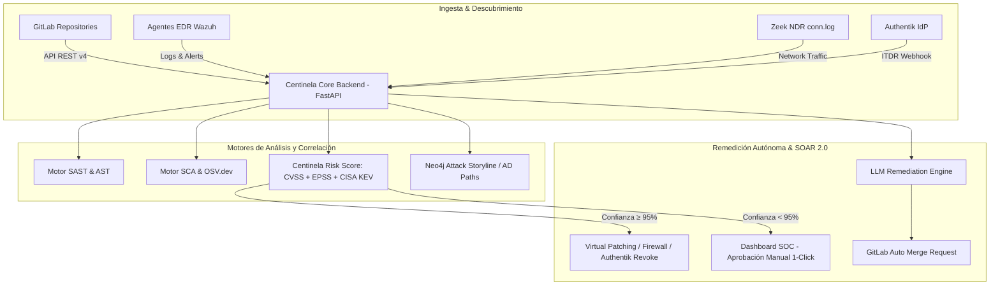

# 🛡️ Presentación Ejecutiva y Técnica: Plataforma Centinela-AI
> **Ecosistema Omni-XDR & AI Governance para la Organización**  
> *Documento de Propuesta Técnica, Estratégica y de Comercialización para Aprobación Directiva*

---

## 📌 Índice de la Presentación

1. **Resumen Ejecutivo**
2. **Origen y Justificación**: *¿Por qué se desarrolló Centinela-AI?*
3. **Propósito y Finalidad**: *¿Para qué sirve?*
4. **Visión General y Funcionalidades Clave**: *¿Qué hace el sistema?*
5. **Arquitectura y Funcionamiento Técnico**: *¿Cómo funciona?*
6. **Beneficios Organizacionales**: *¿Qué aporta a la empresa?*
7. **Estrategia de Comercialización Futura**: *Modelo de Negocio y Monetización (SaaS / Enterprise)*
8. **Hoja de Ruta (Roadmap) y Siguientes Pasos**

---

## 1. 🚀 Resumen Ejecutivo

**Centinela-AI** es una plataforma unificada de **Omni-XDR (Extended Detection & Response), Seguridad DevSecOps y Gobernanza de Inteligencia Artificial**. 

Diseñada bajo un enfoque estrictamente defensivo, actúa como el centro neurálgico de ciberseguridad para la organización. Consolida en un solo panel (*Single Pane of Glass*) el escaneo de código fuente, la auditoría de dependencias, la protección de contenedores, la telemetría de red y servidores, y la respuesta automatizada ante incidentes (SOAR 2.0) impulsada por IA Generativa.

---

## 2. 💡 Origen y Justificación: ¿Por qué se desarrolló?

La evolución acelerada de las amenazas informáticas y la adopción de herramientas de IA y microservicios genera los siguientes problemas críticos en la industria:

* **Fragmentación de Herramientas (Tool Sprawl):** Las organizaciones emplean entre 10 y 15 herramientas desconectadas (SAST, SCA, DAST, EDR, CSPM), generando silos de información, alertas duplicadas y sobrecarga operativa (*alert fatigue*).
* **Falta de Gobernanza sobre Inteligencia Artificial (OWASP Top 10 para LLMs):** El uso creciente de modelos IA expone vectores de ataque nuevos (inyección de prompts, fuga de PII, ejecución de código no controlado).
* **Brecha entre Detección y Remediación:** Detectar una vulnerabilidad (CVE) suele tomar minutos, pero corregirla en producción lleva semanas o meses por falta de parches automatizados.
* **Costos Elevados de Licenciamiento:** Las soluciones XDR y SIEM del mercado corporativo imponen costos por gigabyte o activo que escalan de forma insostenible.

---

## 3. 🎯 Propósito y Finalidad: ¿Para qué sirve?

La finalidad principal de Centinela-AI es **proteger los activos digitales de la organización en tiempo real, garantizar el cumplimiento normativo e institucional y reducir el Tiempo Medio de Reparación (MTTR)** mediante automatización inteligente.

### Objetivos Clave:
1. **Detección Omnidireccional:** Visibilidad 360° sobre aplicaciones, repositorios, código, infraestructura local/nube y modelos LLM.
2. **Remediación Autónoma (SOAR 2.0):** Generación automática de parches y Merge Requests (MRs) en GitLab sin degradar el código de producción.
3. **Cumplimiento Automático:** Mapeo instantáneo de hallazgos hacia marcos normativos (**ISO 27001**, **NIST SP 800-53**, **PCI-DSS v4.0**, **SOC 2**, **GDPR**, **ISO 25010** y **STRIDE**).

---

## 4. 🔍 Visión General y Funcionalidades Clave: ¿Qué hace el sistema?

Centinela-AI se estructura sobre **6 Pilares de Auditoría e Integración**:

| Pilar / Módulo | Funcionalidades Principales | Herramientas & Motores Integrados |
| :--- | :--- | :--- |
| **1. Auditoría SAST & Clean Code** | Detección de SQLi, Command Injection, SSRF, BOLA, Secretos Hardcodeados, Complejidad Cognitiva (<15) e ISO 25010. | Motor AST nativo, Semgrep |
| **2. Auditoría SCA & Dependencias** | Análisis de dependencias (npm, pip), vulnerabilidades conocidas y reached/unreachable reachability analysis. | Motor SCA nativo ([OSV.dev](https://osv.dev)) |
| **3. Hardening e Infraestructura (IaC)** | Análisis de Dockerfiles (antipatrón `root`), manifiestos Kubernetes, Terraform y CIS Benchmarks Linux Level 1 (SSH). | Checkov, Auditor CIS SSH nativo |
| **4. Gobernanza de IA & LLMs** | Inyección de prompts (OWASP LLM01), fuga de datos/PII (LLM02), ejecución de código inseguro (LLM06). | `medusa-security`, OWASP LLM Engine |
| **5. Monitoreo Runtime (EDR / NDR / ITDR)** | Detección de amenazas de identidad Authentik, telemetría de red, ingesta de syscalls kernel e integración con agentes de host. | Wazuh EDR, Zeek NDR, eBPF Tracing |

---

## 💡 Conceptos Fundamentales: ¿Qué es EDR y qué es XDR?

### 1. EDR (Endpoint Detection and Response)
- **Definición:** Es una tecnología de ciberseguridad instalada directamente en los **endpoints** (servidores Linux, servidores Windows, computadoras de escritorio, laptops macOS).
- **Propósito:** Monitorea la actividad continua a nivel de sistema operativo: procesos ejecutados, modificaciones en el registro o archivos de sistema, conexiones de red salientes y comportamientos sospechosos (ej. ejecución de PowerShell malicioso, elevación de privilegios `sudo`).
- **En Centinela-AI:** Se implementa mediante el agente **Wazuh EDR**, ofreciendo respuesta activa y aislamiento de host (*Host Containment*).

### 2. XDR (Extended Detection and Response)
- **Definición:** Es la evolución del EDR que **extiende la visibilidad más allá del endpoint**, integrando múltiples capas del entorno digital: red, código fuente, identidades (IdP), contenedores Docker/Kubernetes y servicios Nube/API.
- **Propósito:** Correlaciona eventos que de forma aislada parecen inofensivos pero que juntos forman un ataque complejo (Kill Chain de MITRE ATT&CK). Por ejemplo: combina una alerta de escaneo de red (NDR), un intento fallido de login en Authentik (ITDR), y una inyección de código en un repositorio GitLab (SAST).
- **En Centinela-AI:** Actúa como un **Omni-XDR de 360°**, ingiriendo y correlacionando automáticamente telemetría de EDR, NDR, SAST, SCA, ITDR e IA Generativa en un único panel (*Single Pane of Glass*).
| **6. Auto-Fix DevSecOps & SOAR 2.0** | Generación autónoma de parches determinísticos y vía LLM con creación de Merge Requests en GitLab. | GitLab REST API, Groq/LLM Engine |

---

## 5. ⚙️ Arquitectura y Funcionamiento Técnico: ¿Cómo funciona?



### Flujo de Operación Técnica:
1. **Descubrimiento Continuo:** Se conectan repositorios GitLab y servidores.
2. **Análisis Multicapa:** Se ejecutan los motores SAST, SCA, DAST e IaC.
3. **Puntuación de Riesgo Dinámica (CRS):** Combina severidad CVSS con probabilidad de explotación real (**EPSS**) y presencia en catálogos de ataques activos (**CISA KEV**).
4. **Remediación Segura:**
   - **Parchado Mecánico (Sin LLM):** Corrección automática de versiones obsoletas o directivas de Docker.
   - **Parchado por IA (Diff Unificado):** Generación de parches precisos para código complejo sin alterar la lógica de negocio.
   - **Enrutamiento Git:** Todo cambio genera una rama `centinela-fix/*` y un Merge Request formal; **nunca se fuerza push directo**.

---

## 6. 🏆 Beneficios Organizacionales: ¿Qué aporta su uso?

### Para la Dirección / Ejecutivos:
* **Reducción de Riesgo de Brechas:** Blindaje preventivo de la superficie de ataque corporativa.
* **Ahorro de Costos Directos:** Eliminación de múltiples licencias individuales de ciberseguridad.
* **Cumplimiento Normativo Instantáneo:** Generación de reportes de auditoría PDF para **ISO 27001**, **NIST**, **PCI-DSS** y **SOC 2** con un clic.

### Para el Líder de Equipo y Arquitectos:
* **Visibilidad Centralizada:** Un solo tablero para controlar vulnerabilidades, calidad de software e infraestructura.
* **Priorización Basada en Riesgo Real:** Focalización en vulnerabilidades explotables en el mundo real (EPSS/CISA KEV) en lugar de listas masivas irrelevantes.
* **Control de Calidad (Quality Gates):** Integración nativa con pipelines CI/CD para impedir la salida a producción de código vulnerable.

### Para el Equipo de Desarrollo:
* **Fricción Cero:** Remediación automatizada mediante Merge Requests listos para revisar y fusionar.
* **Educación y Buenas Prácticas:** Explicación detallada en cada MR sobre el motivo de la vulnerabilidad y cómo prevenirla.
* **Feedback Temprano (Shift Left):** Detección de fallos de seguridad durante la etapa de código, no en producción.

---

## 7. 💼 Estrategia de Comercialización Futura

Centinela-AI posee un alto potencial para posicionarse como un producto **B2B SaaS / Enterprise On-Premise** en el mercado de ciberseguridad.

### Modelos de Monetización Propuestos:

```
                  ┌──────────────────────────────────────────┐
                  │          Modelos de Negocio              │
                  └────────────────────┬─────────────────────┘
                                       │
         ┌─────────────────────────────┼─────────────────────────────┐
         ▼                             ▼                             ▼
┌──────────────────┐         ┌──────────────────┐         ┌──────────────────┐
│ SaaS Enterprise  │         │ On-Premise Self- │         │  MSSP / Managed  │
│    (Cloud)       │         │    Hosted        │         │     Services     │
├──────────────────┤         ├──────────────────┤         ├──────────────────┤
│ Pago por Activo  │         │ Licencia Anual   │         │ Licencia para    │
│ o Repositorio    │         │ por Nodo / Core  │         │ Consultoras de   │
│ Monitoreado      │         │ + Soporte VIP    │         │ Ciberseguridad   │
└──────────────────┘         └──────────────────┘         └──────────────────┘
```

1. **SaaS Enterprise (Nube Administrada):**
   - Suscripción mensual/anual basada en la cantidad de activos monitoreados (repositorios, servidores, contenedores).
   - Planes *Tiered*: Standard, Professional y Enterprise.
2. **Enterprise On-Premise / Air-Gapped (Para Banca, Gobierno y Salud):**
   - Licenciamiento por nodos/infraestructura para clientes con requerimientos estrictos de privacidad que no pueden enviar datos a la nube.
3. **Plataforma para Consultoras de Seguridad (MSSP Partner Program):**
   - Licencias multitenant para empresas de auditoría que ofrecen servicios gestionados de SOC y DevSecOps a sus clientes.

---

## 8. 🗺️ Hoja de Ruta (Roadmap) y Siguientes Pasos

Para consolidar la aprobación directiva y avanzar a la fase de desarrollo a profundidad:

- [x] **Fase 1: Core Engine & Multi-Auditor (Completado)**  
  Integración de motores SAST/SCA nativos, EDR/NDR, reglas ISO/NIST y motor de parches GitLab.
- [x] **Fase 2: Estrategia Híbrida & Multi-OS EDR (Completado)**  
  Instaladores desatendidos para Linux, Windows y macOS; soporte IPv6, monitoreo Agentless y matriz CMMI / ISO 27001.
- [ ] **Fase 3: Expansión Cloud-Native & CSPM**  
  Ampliación de conectores para AWS, GCP y Azure; integración con Prowler y Kubernetes Admission Controllers en caliente.
- [ ] **Fase 4: Certificación de Cumplimiento Oficial**  
  Certificación del producto bajo esquemas SOC 2 Type II e ISO 27001 para comercialización internacional.

---

## 9. 💡 Justificación Estratégica: Software Open Source vs. Soluciones Comerciales

### ¿Por qué Centinela adopta una Estrategia Open Source + EDR en esta Fase?
1. **Eficiencia Presupuestaria y Retorno de Inversión (ROI):**
   - El costo anual de licencias comerciales tradicionales (Qualys, Tenable, CrowdStrike) para 100+ activos supera los **$80,000 USD/año**.
   - La arquitectura Open Source de Centinela (Wazuh, Zeek, Trivy, Nuclei, Vault, ClickHouse) elimina el costo recurrente de licencias, dirigiendo el presupuesto hacia ingeniería y personalización interna.
2. **Soberanía de Datos y Cumplimiento Zero-Trust:**
   - La telemetría, código fuente y secretos nunca abandonan la infraestructura de CASMARTS ni se envían a nubes de terceros no auditables.
3. **Flexibilidad e Integración Híbrida:**
   - Centinela incluye conectores para integrar soluciones comerciales existentes (VirusTotal Enterprise, MISP, Qualys, Tenable.io) mediante conectores API centralizados almacenados en HashiCorp Vault.

---

## 10. 🛡️ Estándares Internacionales EDR/XDR, Matriz de Cumplimiento y Mapeo de Puertos

### A. Cobertura Multi-Sistema Operativo y Descarga de Agentes
- **Linux (Ubuntu, Debian, RHEL, CentOS):** Script Bash desatendido (`.sh`) con configuración automática de repositorio.
- **Windows (Server 2019/2022, Windows 10/11):** Script PowerShell desatendido (`.ps1`) ejecutado en modo Administrador.
- **macOS (Apple Silicon M1-M3 & Intel):** Script Zsh (`.sh`) para despliegues en estaciones de trabajo institucionales.
- **Agentless / En Línea:** Monitoreo ICMP/TCP sin credenciales para dispositivos donde no es posible instalar software (Cisco, VMware, Cloud).

### B. Mapeo de Puertos de Red
| Puerto / Protocolo | Origen → Destino | Propósito |
| :--- | :--- | :--- |
| `1514 / TCP-UDP` | Agente → Manager (`10.4.3.34`) | Telemetría de eventos cifrada Wazuh EDR |
| `1515 / TCP` | Agente → Manager (`10.4.3.34`) | Inscripción automática de agentes nuevos |
| `55000 / TCP` | Backend → Manager (`10.4.3.34`) | API REST de orquestación y control |
| `5432 / 3306 / 1433` | Probes → RDBMS | Auditoría de bases de datos PostgreSQL / MySQL / SQL Server |

### C. Matriz de Cumplimiento Normativo Auditada
| Estándar Internacional | Control / Área de Proceso | Mecanismo en Centinela AI |
| :--- | :--- | :--- |
| **ISO/IEC 27001:2022** | Control A.8.8 (Gestión de Vulnerabilidades) | Escaneo automatizado diario con 5 motores SAST/SCA/DAST |
| **ISO/IEC 27001:2022** | Control A.8.16 (Actividades de Monitoreo) | Telemetría continua con Wazuh EDR, eBPF y Zeek NDR |
| **CMMI v2.0 Level 3-5** | Causal Analysis & Resolution (CAR) | Análisis de causa raíz asistido por IA y registro de deuda técnica |
| **CMMI v2.0 Level 3-5** | Supplier Agreement Management (SAM) | Auditoría de dependencias Open Source y parches en Merge Requests |
| **NIST CSF 2.0** | PR.PS-01 / DE.CM-01 | Verificación de hardening y detección de anomalías de red |

---

> [!TIP]
> **Conclusión para los Directivos y Líderes de Proyecto:**  
> Centinela-AI no solo protege la infraestructura actual de CASMARTS reduciendo costos operativos y riesgos de ciberseguridad, sino que se constituye como un **activo tecnológico soberano de alto valor**, 100% alineado con las exigencias del Project Manager y los más altos estándares internacionales de la industria.
